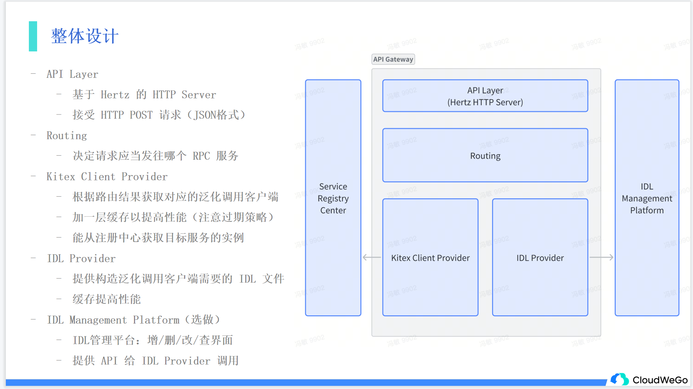

# cloudwego-api-gateway
基于cloudwego进行api网关开发




### 模块划分


### 接口说明


### 部署步骤说明

#### 1. 安装依赖
##### 1.1 安装hertz相关依赖

详见 https://www.cloudwego.io/zh/docs/hertz/getting-started/

##### 1.2 安装vue相关依赖

pkg/IDL-Management/vue-front里是前端代码，需要安装vue相关依赖

详见 https://www.cnblogs.com/mjtabu/p/14324270.html

##### 1.3 安装go相关依赖

略
    

#### 2. 启动服务

##### 2.1 shell脚本启动

```shell

sudo apt install gnome-terminal //支持启动多个终端
sudo apt-get install gnome-session
sh run.sh
```

##### 2.2 手动启动

```shell
//启动hertz-back
cd pkg/IDL-Management/hertz-back
go build
./hertz-back
//启动vue-front
cd pkg/IDL-Management/vue-front
npm run dev
//启动gateway
go build
./cloudwego-api-gateway
```


